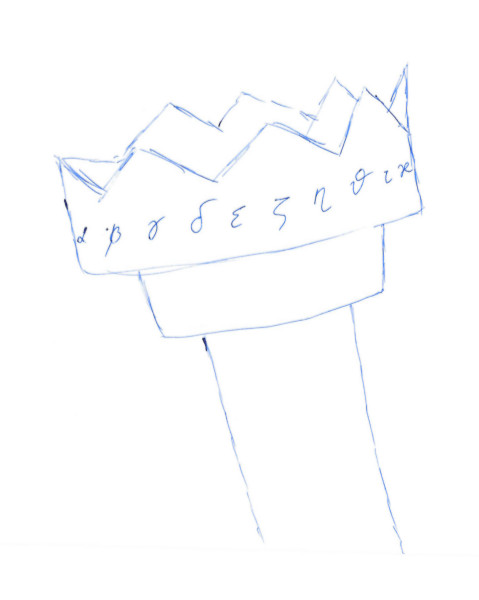

# Равномерное распределение точек на сфере #

## Часть 2. Минимизация функционала с помощью pytorch. ##

Вы читаете продолжение [публикации](). В предыдущей части было рассказано, как рассчитать потенциал системы материальных точек, которые отталкиваются друг от друга по электростатическому закону и притягиваются к поверхности единичной сферы. Здесь мы обсудим, как минимизировать эту функцию с помощью библиотеки pytorch.

